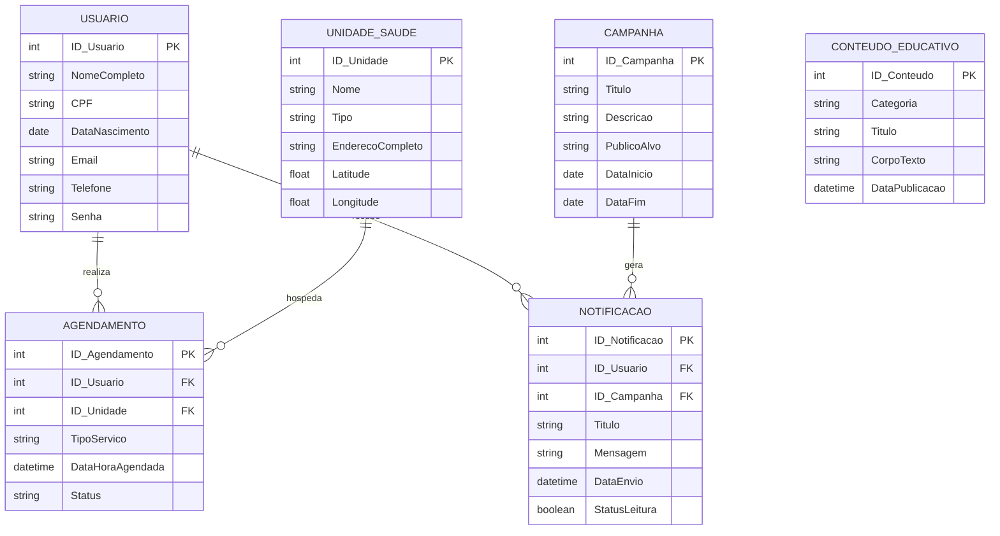

---

# CommuniCare: Saúde e Bem-Estar Comunitário

O **CommuniCare** é um aplicativo focado em saúde preventiva e informativa, criado para fortalecer a conexão entre a população e os serviços públicos locais. A plataforma atua como uma central de cuidado integrado, permitindo não apenas o agendamento ágil de consultas e exames online, mas também a busca inteligente de postos de saúde, hospitais e farmácias por geolocalização. Mais do que um facilitador logístico, o sistema promove o cuidado contínuo ao enviar notificações ativas sobre campanhas de vacinação e disponibilizar um canal exclusivo com orientações práticas sobre primeiros socorros e saúde mental.

## Objetivos

O principal objetivo do CommuniCare é democratizar e ampliar o acesso aos serviços básicos de saúde, tornando o atendimento público mais moderno, ágil e centrado no cidadão. A plataforma busca promover uma forte cultura de prevenção, reduzindo a distância entre as campanhas de saúde pública e a população por meio da comunicação ativa. Além disso, visa empoderar o usuário, fornecendo educação em saúde contínua e garantindo que ele encontre o suporte ou a infraestrutura adequada rapidamente, o que otimiza tanto o tempo do paciente quanto o fluxo de atendimento nas unidades de saúde.

## Tecnologias Utilizadas

*   *Linguagem:* Java 21
*   *Framework:* Spring Boot 4.0.6
*   *Gerenciador de Dependências:* Maven
*   *Persistência de Dados:* Spring Data JPA / Hibernate
*   *Segurança:* Spring Security + JWT (JSON Web Token)
*   *Documentação:* Swagger UI / OpenAPI 3.0
*   *Testes:* JUnit 5, Mockito e Testcontainers 
*   *Banco de Dados:* PostgreSQL 

## Diagrama do Banco de Dados

## Documentação da API e Segurança

### Swagger UI & OpenAPI 3.0
A API está totalmente documentada de forma interativa utilizando o **Springdoc OpenAPI**.
* **Swagger UI (Interativo):** [http://localhost:8080/swagger-ui.html](http://localhost:8080/swagger-ui.html)
* **Especificação OpenAPI (JSON):** [http://localhost:8080/v3/api-docs](http://localhost:8080/v3/api-docs)

### Autenticação no Swagger
Endpoints protegidos exigem autenticação baseada em token JWT. 
1. Realize uma requisição `POST /auth/login` com credenciais válidas.
2. Copie o token retornado na resposta.
3. No topo do Swagger UI, clique no botão **Authorize**, digite o token JWT no campo de texto e confirme.

### Resumo dos Endpoints Ativos
* **Autenticação (`/auth`)**: Registro público de usuários (`POST /register`) e Login (`POST /login`).
* **Usuários (`/usuarios`)**: Consulta (`GET /{id}`), atualização segura (`PUT /{id}`) e exclusão de perfil (`DELETE /{id}`).
* **Unidades de Saúde (`/unidades`)**: Cadastro (`POST`), listagem (`GET`), consulta por ID (`GET /{id}`), atualização (`PUT /{id}`) e exclusão (`DELETE /{id}`).
* **Agendamentos (`/agendamento`)**: Agendamento de consultas (`POST /agendar`), consultas (`GET /{id_agendamento}`, `GET /data/{dataHoraAgendamento}`), atualização (`PUT /atualizar/{id_agendamento}`) e cancelamento (`PUT /deletar/{id_agendamento}`).

## Integrantes

Estudantes do 3º Período de ADS na UNINASSAU Paulista - 2026

- *João Miguel Francisco de Souza* (Líder)
- *Carlos Eduardo De Lira Almeida*
- *Iclei Arthur Rodrigues de Oliveira*
- *Thalita Izabelle Cunha dos Santos Silva*
- *Guilherme Batista Alves*

---

